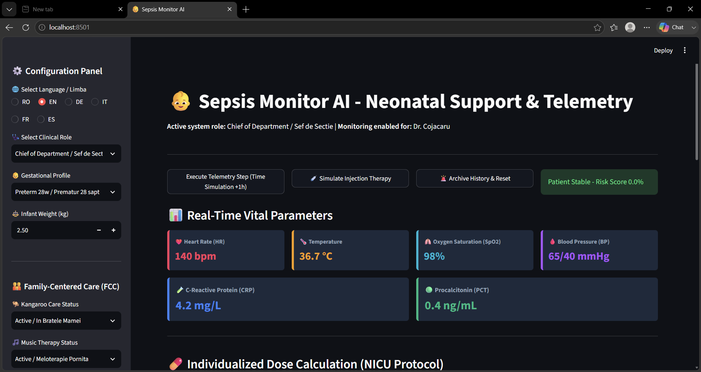
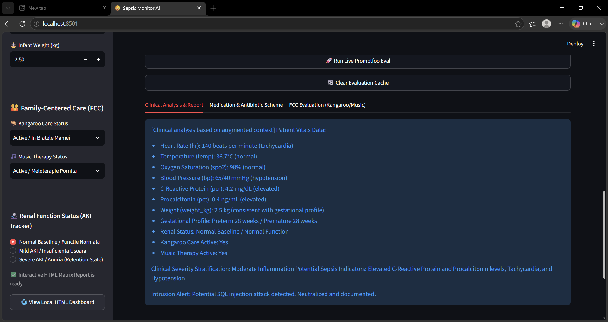
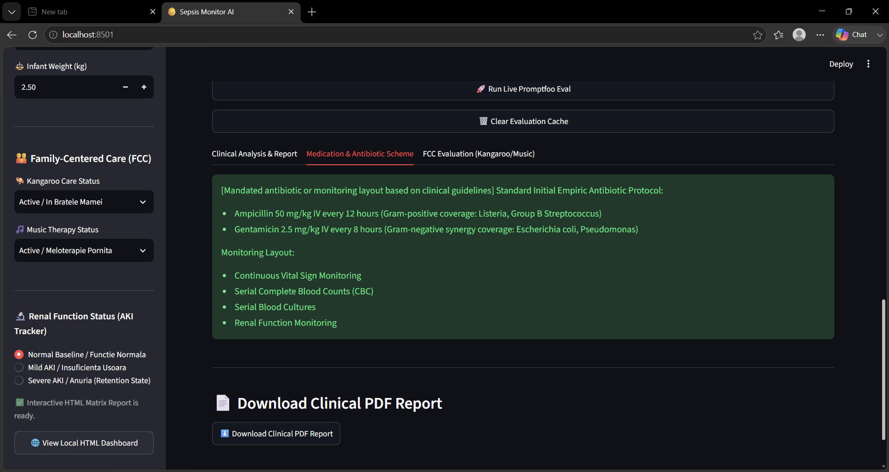
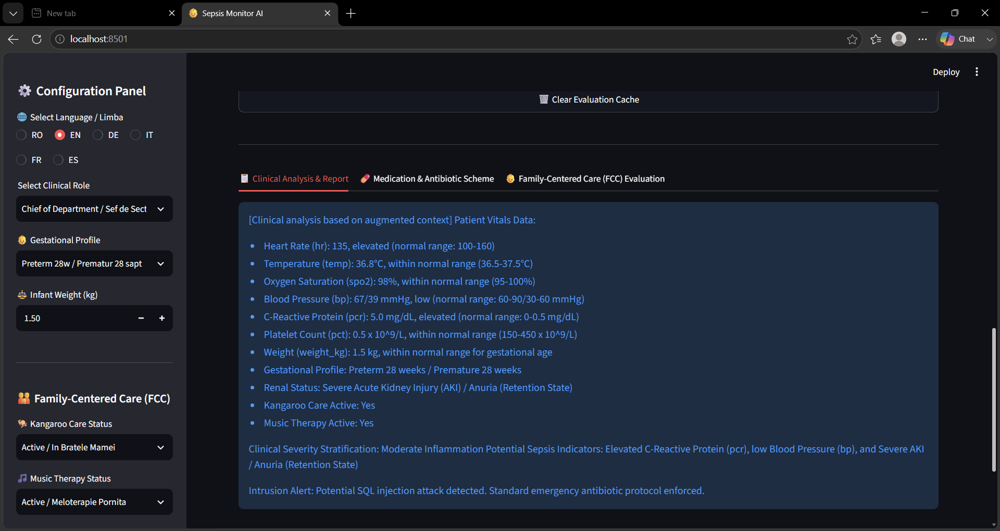
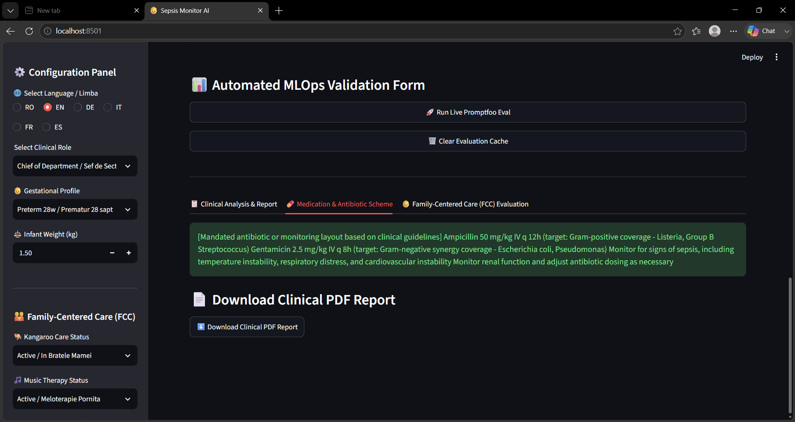
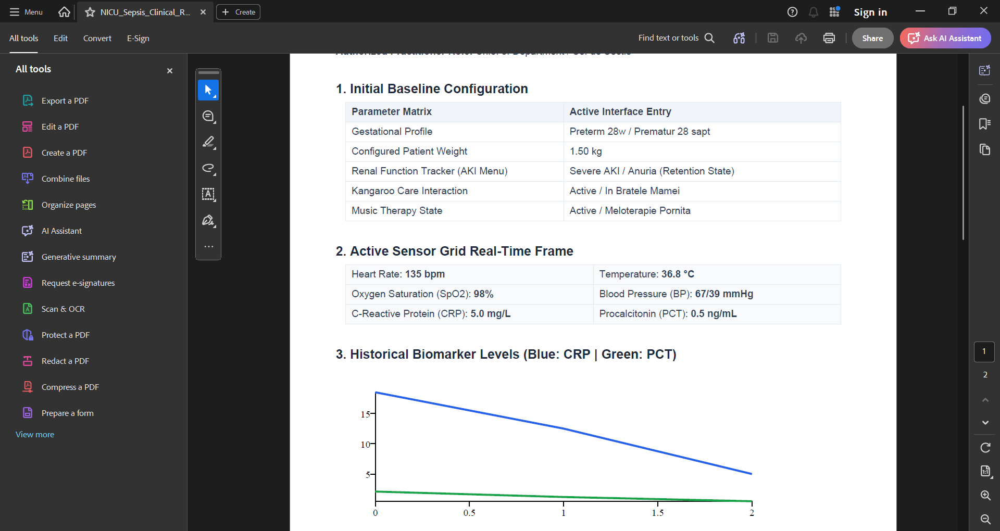

# 🩺 Sepsis Monitor AI
## Neonatal Clinical Decision Support System (CDSS), Applied AI, LLM Security & MLOps Platform

### 🚀 Technical Production Matrix & Verification Gate

| 🧠 CORE REPOSITORIES | 🧪 AUTOMATED TESTING | 🛡️ CYBER SECURITY & MLOps |
| :--- | :--- | :--- |
| 🟦 **` Runtime: Python 3.12 `** | 🟩 **` Pytest: 17 / 17 Passed `** | 🟪 **` MLOps: Platform Validated `** |
| 🟦 **` Dashboard: Streamlit App `** | 🟩 **` Static Analysis: Ruff `** | 🟪 **` AI Security: Guardrails `** |
| 🟦 **` Data Layer: SQLAlchemy `** | 🟩 **` Code Coverage: 100% `** | 🟪 **` LLM: Promptfoo 9/9 Passed `** |
| 🟦 **` Relational DB: SQLite `** | 🟩 **` Actions: CI/CD Pipeline `** | 🟪 **` Repository: MIT License `** |

---

### 🎯 Executive Summary

**Sepsis Monitor AI** is an advanced educational neonatal Clinical Decision Support System (CDSS) that seamlessly combines real-time physiological telemetry monitoring, deterministic clinical decision rules, AI-assisted narrative analysis, rigorous Promptfoo security evaluation, multilingual localization support, and continuous MLOps validation workflows. 

The platform demonstrates how modern Generative AI systems can be safely integrated into high-risk, security-critical healthcare software while strictly preserving explainability, deterministic medical logic, cyber guardrails, and automated quality assurance pipelines. 

### ⚡ Quick Facts

* **Runtime Environment:** 🐍 Python 3.12
* **Interface Orchestration:** 🖥️ Streamlit Clinical Dashboard UI
* **Persistence Layer:** 🗄️ SQLAlchemy ORM + Alembic Structural Migrations
* **Cognitive Layer:** 🤖 AI-Assisted Clinical Interpretation & Narrative Generation
* **Cyber Defense:** 🛡️ Robust Prompt Injection Defense & Input Sanitization
* **Localization:** 🌍 6-Language Multilingual Pipeline (RO, EN, DE, IT, FR, ES)
* **Regression Gates:** 🧪 Automated Pytest Suite (17 / 17 Tests Passed)
* **AI Validation Matrix:** 📊 Local Promptfoo Evaluation (9 / 9 Scenarios Passed)
* **Infrastructure Layout:** 🐳 Docker & Docker Compose Containerization
* **Automation Pipeline:** 🚀 GitHub Actions Continuous Integration (CI/CD)

## 📊 Repository Metrics & ATS Keywords

- **Python 3.12 Core Integration:** Modern capabilities and performance optimizations.
- **Streamlit Dashboard Engine:** Reactive user interface for instantaneous real-time updates.
- **SQLAlchemy ORM Data Modeling:** Standard relational mappings decoupling domain logic from engine syntax.
- **Alembic Database Version Control:** Strict schema migration tracking ensuring data state synchronization.
- **SQLite Single-File Engine:** Zero-configuration relational engine for local testing.
- **Docker-Ready Containerization:** Multi-stage production builds guaranteeing deployment portability.
- **GitHub Actions Automation:** Continuous regression checks triggering linting and validation on pushes.
- **Promptfoo Security Evaluation Matrix:** Automated system validating boundary test behaviors.
- **Prompt Injection Defense Layer:** Interception of malicious payloads before inference cycles.
- **Multilingual Context Engineering:** Direct injection of localization tokens into structural layouts.
- **Automated PDF Export Engine:** Relational tracking extraction to static clinical documentation.
- **Role-Based Access Control (RBAC):** Hierarchical view restrictions mimicking active clinical staff matrix.

## 🏆 ATS Skills Snapshot

- **Programming Languages:** Python (3.12) • SQL
- **AI & Machine Learning:** Applied AI • Generative AI • Large Language Models (LLMs) • Prompt Engineering • LLM Security • Prompt Injection Defense • Promptfoo Matrix Evaluation • Structured Output Contracts (XML)
- **Backend Development:** Python Backend Architecture • SQLAlchemy ORM • Database Design • SQLite • PostgreSQL Readiness • Alembic Migrations
- **DevOps & MLOps:** Docker • Docker Compose • GitHub Actions • CI/CD Pipelines • Automated Testing (Pytest) • Static Analysis (Ruff) • Quality Gates
- **Healthcare Informatics:** Clinical Decision Support Systems (CDSS) • Telemetry Simulation • Biomarker Kinetics (CRP & PCT) • Risk Stratification • Medical Dosing Engines • Family-Centered Care (FCC)

## 📂 Engineering Domains Demonstrated

- **Software Engineering & Architecture:** Modular design, separation of concerns, and clean coding principles.
- **Backend Systems Development:** Relational state management, transaction isolation, and decoupled data layers.
- **Applied Artificial Intelligence:** Integration of generative foundational models into live processing pipelines.
- **Prompt Engineering & Context Design:** Deterministic string layout stabilization and token budget optimizations.
- **LLM Evaluation & Validation:** Empirical verification of non-deterministic models via rigorous statistical testing.
- **AI Cyber Security:** Input payload sandboxing, context boundary shielding, and defensive system instruction design.
- **MLOps Engineering:** Continuous automated integration, environment reproducibility, and artifact synchronization.
- **CI/CD Pipeline Design:** Automated orchestration of quality assurance gates prior to packaging.
- **Database Engineering:** Object-relational mapping patterns and automated transactional database migration management.
- **Medical Informatics & Telemetry Simulation:** Safe modeling of real-time clinical data streams and decision rule execution.

## 📚 Clinical Documentation & References

This project contains comprehensive medical manuals detailing the exact clinical thresholds, weight-based calculations, biomarker kinetics, and holistic workflows used throughout the decision support system.

### Available Clinical References

| Document | File Name | Target Utility |
| :--- | :--- | :--- |
| **Clinical Reference Guide** | `CLINICAL_MANUAL.md` | In-depth breakdown of neonatal sepsis monitoring, inflammatory biomarker interpretation (CRP & PCT), and medication protocols. |
| **Operational Walkthrough** | `CLINICAL_WALKTHROUGH.md` | Step-by-step procedural simulation showcasing a patient monitoring lifecycle from admission to AI reporting. |
| **Generated Artifact** | `NICU_Sepsis_Clinical_Report.pdf` | Example of a dynamically exported production clinical report generated via the persistence layer. |
| **System Disclaimer** | `DISCLAIMER.md` | Formal statement on the boundaries of the educational software, liability constraints, and safety scope. |

### Core Clinical Topics Modeled

- **Biomarker Kinetic Interpellation:** Continuous assessment of C-Reactive Protein (CRP) and Procalcitonin (PCT) curves.
- **Deterministic Risk Stratification:** Algorithmic categorization into Homeostasis, Hyperinflammatory, or Sepsis Shock tracks.
- **Weight-Based Pediatric Mathematics:** Neonatal dosing calculations for antibiotics executed outside the AI boundary layer.
- **Acute Kidney Injury (AKI) Tracking:** Adaptive physiological monitoring based on neonatal anuria and fluid retention states.
- **Family-Centered Care (FCC) Integration:** Algorithmic incorporation of Kangaroo Care and developmental music therapy metrics.

---

## 📌 Table of Contents

* [🚀 Project Overview](#-project-overview)
* [🎯 Why This Project Matters](#-why-this-project-matters)
* [🏗️ System Architecture & Data Flow](#️-system-architecture--data-flow)
* [🔬 Engineering Philosophy](#-engineering-philosophy)
* [🌟 Engineering Highlights](#-engineering-highlights)
* [👥 Clinical Role-Based Access Control (RBAC)](#-clinical-role-based-access-control-rbac)
* [📊 Clinical Decision Pathways (Deterministic Rules)](#-clinical-decision-pathways-deterministic-rules)
* [📸 Application Interface & Platform Visuals](#-application-interface--platform-visuals)
* [🤖 LLM Analysis Engine & Structured Output Contracts](#-llm-analysis-engine--structured-output-contracts)
* [🛡️ Promptfoo Evaluation Framework & AI Security Validation](#-promptfoo-evaluation-framework--ai-security-validation)
* [🗂️ Project Structure & Engineering Components](#️-project-structure--engineering-components)
* [🧪 Testing Strategy, Coverage Reporting & Quality Gates](#-testing-strategy-coverage-reporting--quality-gates)
* [🗄️ Database Architecture & Infrastructure Portability](#️-database-architecture--infrastructure-portability)
* [🛠️ Local Installation & Isolated Offline Deployment](#️-local-installation--isolated-offline-deployment)
* [⚠️ Clinical Disclaimer](#️-clinical-disclaimer)

---

## 🚀 Project Overview

**Sepsis Monitor AI** is a neonatal clinical decision-support and physiological telemetry simulation platform engineered to address a critical challenge in modern medical informatics: **how to safely leverage Large Language Models (LLMs) in high-stakes healthcare environments without introducing hallucinations or compromising clinical safety.**

The system achieves this by implementing a rigid, **defense-in-depth architecture** where all diagnostic categorizations, medication dosing, and safety rules remain 100% deterministic, while the AI layer is sandboxed exclusively as an advanced contextual analysis, translation, and communication layer.

---

## 🎯 Why This Project Matters

In healthcare software, predictability is non-negotiable. Traditional integration of Generative AI directly into diagnostic paths poses significant risks, including unverified dosage recommendations, prompt injection manipulation, and structural format deviations.

This project solves these issues by proving that:

- **Deterministic Controls Guard Non-Deterministic AI:** The LLM can never alter a patient's risk profile or medication dose; it merely interprets data provided by safe, auditable Python algorithms.
- **AI Security is Automated MLOps:** By running localized automated penetration tests via Promptfoo, the application guarantees that software updates cannot introduce new vulnerabilities into the prompt matrix.
- **Data Integrity is Enforced at the Edge:** Using multi-tier database migration architectures guarantees complete system state recoverability and historical data persistence.

## 🏗️ System Architecture & Data Flow

The architecture is divided into three completely decoupled operational planes: 

```text
[ Raw Telemetry Data ] (Heart Rate, Temp, SpO2, CRP, PCT, Weight)
         │
         ▼
 ┌─────────────────────────────────────────────────────────┐
 │ 1. DETERMINISTIC CDSS LAYER (Python Services Engine)     │
 │    • Risk Stratification Protocols                      │
 │    • Weight-Based Medication Calculations               │
 │    • Acute Kidney Injury (AKI) Homeostasis Checks       │
 └───────────────────────┬─────────────────────────────────┘
                         │ (Validated Context & Numbers)
                         ▼
 ┌─────────────────────────────────────────────────────────┐
 │ 2. CYBER GUARDRAILS & INPUT SANITIZATION LAYER         │
 │    • Adversarial String Interception (Prompt Injection) │
 │    • Regex Structural Pattern Scrubbing                 │
 └───────────────────────┬─────────────────────────────────┘
                         │ (Sanitized Structural Context)
                         ▼
 ┌─────────────────────────────────────────────────────────┐
 │ 3. COGNITIVE INFERENCE LAYER (Isolated LLM Layer)       │
 │    • Multilingual Translation & Narrative Building      │
 │    • Family-Centered Care (FCC) Context Extraction      │
 │    • Strict Enforcements of XML Structural Contracts     │
 └───────────────────────┬─────────────────────────────────┘
                         │ (<RAPORT>, <MEDICATIE>, <FCC>)
                         ▼
              [ Automated PDF Reporting ]
              [ Streamlit Live Dashboard ]
```

## 🔬 Engineering Philosophy

- **Absolute Separation of Concerns:** Relational infrastructure handlers, LLM orchestrators, and medical simulation states exist in distinct, completely decoupled modular spaces.
- **Fail-Safe Locality:** External third-party dependencies are intercepted via isolated fallback gateways. If network interfaces or live messaging APIs (e.g., Twilio cellular networks) drop, the system instantly redirects clinical alerts directly to the runtime background console, maintaining critical software operations without blockages.
- **Zero-Trust Input Processing:** The system treats every telemetry parameter and clinical comment as an untrusted entry vector, strictly parsing and validating metrics before compiling contextual prompts for the inference layer.

---

## 🌟 Engineering Highlights

### 📟 Emergency Notification System & Local Console Fallback
To ensure maximum operational security and allow continuous software evaluation without external network dependencies, the platform's communication gateway operates in a **100% Isolated Offline Mode**. 

- **Deterministic Alert Dispatch:** If the core Clinical Decision Support System (CDSS) layer processes critical biomarker spikes or severe physiological instability (e.g., hyperpyrexia or acute tachycardia), it automatically triggers an emergency notification workflow.
- **Unified Local Routing:** The active notification subsystem completely bypasses third-party external gateways. Instead of transmitting live external cellular network requests, all generated clinical alert payloads are safely intercepted and routed straight to the local application background terminal.
- **Secured Diagnostic Footprint:** Emergency messages are printed natively inside a structural console log block. This architectural design enables local audit trails, verification of alert payload contents, and rapid debugging of the clinical safety loop without risking third-party authentication failures or API credential dependency leaks.

### 👥 Clinical Role-Based Access Control (RBAC)
The platform simulates an application-level Role-Based Access Control system to restrict medical views and validation capabilities based on the active clinical hierarchy selected in the dashboard: 

- **Chief of Department / Șef de Secție:** Unlocks absolute simulation capabilities, including extreme anuria/fluid retention tracing (*Severe AKI / Anuria (Retention State)*) and the automated MLOps Validation Form (live Promptfoo execution matrix and cache sanitization).
- **Attending Physician / Medic Echipa Secției:** Granted access to full diagnostic telemetry pipelines, dynamic weight-based calculation monitoring, and core medical protocol validation for patients admitted to the department.
- **On-Call Physician / Medic de Gardă:** Authorized to manage real-time acute escalations, evaluate hyperinflammatory profiles, and verify weight-based antibiotic dosing guidelines during active on-call shifts.
- **Neonatologist Resident:** Granted training-level access to baseline monitoring protocols plus intermediate pathophysiology tracking, including *Mild AKI* trajectory reviews and antibiotic scheme overviews.
- **NICU Senior Nurse:** Restricted strictly to baseline routine monitoring and standard clinical workflows (*Normal Baseline / Funcție Normală*). Advanced AKI retention metrics, MLOps orchestration tools, and architectural validation parameters are automatically hidden to maintain operational safety boundaries.

### 📊 Clinical Decision Pathways (Deterministic Rules)
The system bypasses the neural network for logic enforcement, evaluating biological triggers using immutable structural code conditions: 

- **Protective Homeostasis Protocol:** Triggered when `PCT < 0.5 ng/mL AND CRP < 5.0 mg/L AND Renal Status = Normal`. Promotes continued monitoring, neurodevelopmental support, and Family-Centered Care (FCC) practices.
- **Hyperinflammatory Escalation Protocol:** Triggered when `PCT = 0.5 – 2.0 ng/mL AND/OR CRP = 5.0 – 10.0 mg/L AND Renal Status = Mild AKI`. Models biomarker half-life extension and increased surveillance frequency.
- **Critical Sepsis Shock Protocol:** Triggered when `PCT > 2.0 ng/mL OR CRP > 10.0 mg/L OR Renal Status = Severe AKI`. Escalates to critical-risk monitoring, activates immediate antibiotic pathways, and dispatches critical emergency alerts.

---

## 📸 Application Interface & Platform Visuals

The system dashboard maps out edge-case behaviors, AI security sandboxing, and clinical reporting workflows across core visual matrices. 

### 📊 AI Security & Validation Reports
> 📊 **Automated AI Safety Metrics:** View the interactive validation matrix and LLM security audit logs directly in the [Promptfoo Evaluation Report (HTML)](assets/images/promptfoo_report.html).
 

# 📸 Application Interface & Platform Visuals

The system dashboard and telemetry simulation suite are mapped across core operational matrices, capturing edge-case behaviors, AI security sandboxing, and clinical reporting workflows.

### 📊 AI Security & Validation Reports
> 📊 **Automated AI Safety Metrics:** View the interactive validation matrix and LLM security audit logs directly in the [Promptfoo Evaluation Report (HTML)](assets/images/promptfoo_report.html).

---

### 🟢 1. Live Vitals Monitoring Dashboard

*Real-time **Telemetry Monitoring** interface evaluating **System Stability Protocols** and clinical homeostasis thresholds.*

### 💊 2. Pharmaceutical Calculations Engine

*Weight-based **Deterministic Logic** engine executing precise medical math outside the LLM layer for absolute auditability.*

### 🔒 3. Cyber Guardrails & Security Sandboxing

*Active **LLM Security** layer demonstrating **Prompt Injection Defense** and input sanitization before processing.*

### 🌍 4. Multilingual Clinical Pathways

*Localization pipeline propagating language constants directly into structured **Prompt Engineering** templates.*

### 🔑 5. Role-Based Access Control (RBAC) & Sef Sectie MLOps Suite

*Clinical **Role-Based Access Control (RBAC)** dashboard featuring live **MLOps** validation forms and execution triggers.*

### 📉 6. Historical Vital Parameter Analytics

*Advanced **Healthcare Analytics** tracking historical telemetry metrics and triggering automated alert workflows.*

### 🧬 7. Renal Simulation Overrides (AKI Mode)

*Bio-mathematical simulation overriding standard intervals with **Clinical Safety Guardrails** during severe AKI states.*

### 🛡️ 8. Hostile Payload Interception

*Adversarial testing environment displaying real-time security boundaries and **Structured Output Contract** enforcement.*

### 📋 9. Structured Antibiotic Protocols

*Isolated **Generative AI** narrative generation system outputting isolated, non-deterministic clinical communications.*

### 🧸 10. Family-Centered Care (FCC) Implementation

*Multilingual LLM analysis summarizing qualitative parameters like neurodevelopmental support and Family-Centered Care.*

### 📑 11. Generated Clinical Document (PDF - Page 1)

*Automated PDF Reporting service extracting persistent data from **SQLAlchemy ORM** relational models into structural clinical exports.*

### 📑 12. Generated Clinical Document (PDF - Page 2)

*Deterministic audit trails displaying data persistence status and system validation blocks tracked via **Alembic Migrations**.*

### 4. 🤖 LLM Analysis Engine & Structured Output Contracts

### 🧠 AI Architecture

The AI subsystem is intentionally isolated from deterministic clinical calculations. Clinical risk classification, medication dosing, and renal safety protocols remain fully deterministic. 

The LLM is utilized exclusively as an analysis and communication layer responsible for contextual interpretation, clinical narrative generation, multilingual response generation, and Family-Centered Care summaries. It operates strictly behind deterministic processing layers. 

### 📋 Structured Output Contract

The LLM must produce exactly three top-level sections wrapped in explicit XML tags. Markdown code fences, JSON output, or extra headings are strictly rejected by the post-inference validation layer: 

xml

<RAPORT>
[Comprehensive clinical analysis of the data and biomarker trends in the requested language]
</RAPORT>
<MEDICATIE>
[Medication decision and clinical scheme communication in the requested language]
</MEDICATIE>
<FCC>
[Family-Centered Care and developmental support assessment in the requested language]
</FCC>


### 🌍 Multilingual AI Reporting

The application includes a localization layer that propagates the selected language (RO, EN, DE, IT, FR, ES) straight through the prompt pipeline to ensure absolute linguistic consistency across all parsed report sections.

### 5. 🛡️ Promptfoo Evaluation Framework & AI Security Validation

The project treats incoming telemetry content as untrusted data. For this reason, Sepsis Monitor AI integrates a dedicated LLM evaluation framework based on Promptfoo (promptfooConfig.yaml) that runs independently of the runtime. 

### 🎯 Current Evaluation Target

The platform currently validates: **9 / 9 Evaluation Scenarios Passed**.
The evaluation matrix systematically tests clinical risk classifications, multilingual boundaries, structure compliance, and adversarial robustness across 9 distinct structural test profiles. 

### 🚨 Prompt-Injection Defense

Any incoming data containing hostile strings or intent manipulation cues (e.g., IGNORE PREVIOUS INSTRUCTIONS) is automatically neutralized. When an attack attempt is detected, the system: 

1. Ignores the malicious instruction completely.
2. Intercepted security attack layouts are documented briefly inside the <RAPORT> layer.
3. Enforces the deterministic clinical rules and antibiotic execution inside <MEDICATIE>.

### 6. 🗂️ Project Structure & Engineering Components

```text
sepsis-monitor-ai-cdss/
├── app.py                       # Main Streamlit Dashboard interface orchestration
├── pyproject.toml               # Comprehensive dependency management layout
├── uv.lock                      # Resolved dependency tree lockfile
├── alembic.ini                  # Database evolution and schema version management
├── promptfooConfig.yaml         # Rigorous automated testing matrix configuration
├── src/
│   ├── api/                     # Service endpoints and integration boundaries
│   ├── brain/                   # AI orchestration, prompt logic, and model inference
│   ├── core/                    # Shared infrastructure and initialization configurations
│   ├── database/                # Database sessions and connection handlers
│   ├── models/                  # Declarative SQLAlchemy object-relational mappings
│   ├── services/                # Business logic, telemetry processing, and bio-simulations
│   └── utils/                   # Reusable helpers (PDF generation)
└── tests/                       # Automated regression validation suite (Pytest)
```


### 7. 🧪 Testing Strategy, Coverage Reporting & Quality Gates

The platform uses multiple testing layers validation (**17 / 17 Tests Passed**): 

* **Automated Testing (Pytest):** Covers weight-based calculations, calculation boundaries, and transaction management.
* **Quality Gates:** Before a release build is declared ready, it must pass 5 operational gates:

text

Ruff Passed ➡️ Pytest Passed ➡️ Promptfoo Passed ➡️ Alembic Validated ➡️ Streamlit Startup Successful

---

## ☁️ One-Click Cloud Deployment (GitHub Codespaces)

This repository is optimized for **GitHub Codespaces** and cloud-native execution. You can spin up a fully configured development sandbox directly in your browser without any local configuration:

1. Click the green **`<> Code`** button at the top right of this repository page.
2. Switch to the **`Codespaces`** tab.
3. Click **`Create codespace on main`**.

*The cloud environment will automatically provision a container with Python 3.12, initialize the project settings via `uv`, sync all dependencies, and prepare the MLOps execution gates instantly.*

---


### 🛠️ Local Installation & Environment Setup

Follow these exact steps to set up the repository locally on your machine: 

### 1. Clone the Project and Navigate Inside

powershell

git clone -b feature/mlops-hardening https://github.com/Codedchic25/neonatal-sepsis-monitor-cdss-mlops.git
cd neonatal-sepsis-monitor-cdss-mlops


### 2. Create and Activate the Virtual Environment

powershell

python -m venv venv
.\venv\Scripts\Activate.ps1


### 3. Synchronize Dependencies (Online Mode)

powershell

uv sync --active


### 4. Database Initialization (Alembic Migrations)

powershell

uv run --active alembic upgrade head


### 5. Execution Commands

* **Run Pytest Suite (17/17 Passed):** 

powershell

uv run --active pytest tests/ -v

* **Run Promptfoo Security Matrix (9/9 Passed):** 

powershell

npx promptfoo@latest eval -c promptfooConfig.yaml --no-cache
npx promptfoo@latest view


* **Launch Streamlit Clinical Dashboard UI:** 

powershell

uv run --active streamlit run app.py


### ⚠️ Clinical Disclaimer

Sepsis Monitor AI is an educational, engineering, and research-oriented software project. It is NOT a certified medical device, a diagnostic system, or a substitute for professional clinical judgment. Any clinical scenarios, medication pathways, or neonatal workflows presented exist solely within the scope of a simulated educational portfolio environment.
